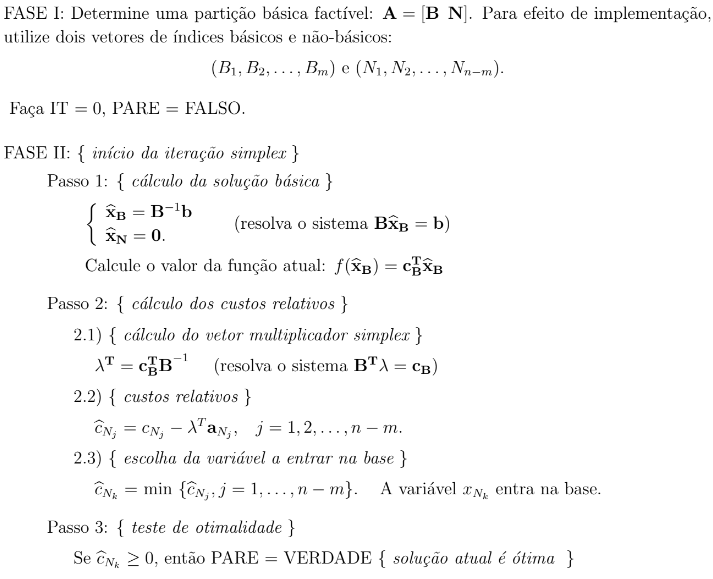
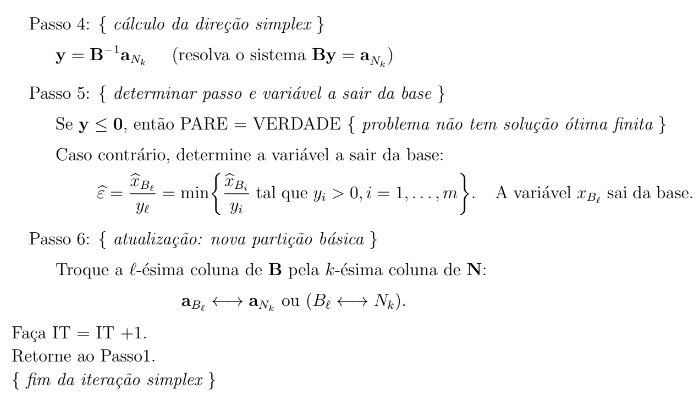

# Metodo Simplex - Algoritmo
 ## Implementação do Metodo Simplex em Duas fases
 Nesse projeto, implementamos o Algoritmo Simplex resolvendo o problema artificial para encontrar uma base factível e , a partir desta , resolver o problema primal Simplex.
 ## Fluxo de execução
 ### Inputs 
 Matriz de restrições(A), vetor de custos(c),vetor dos recursos(b)
 ### Outputs 
 Vetor de variaveis basicas ótimas(x_B)[se existir] , valor ótimo da função(f(x_B))

 ## Suposições
 Supomos que os inputs do problema estão na forma padrão, isto é:
 - b >= 0
 - Todos os problemas estão na forma de minimização
 - Todos as restrições estão na forma de igualdade 
    - Isto é: 
        - 
    - Onde s são as **variaveis de folga** adicionadas 
 ### Primeira Fase
 A primeira fase constitui-se na criação de um problema artificial do tipo:

 
 
 Onde lambda é o vetor das variaveis artificiais criadas para encontrar uma base factivel trivial. Se esse problema tem solução otima com custo zero a partição ótima encontrada corresponde a uma partição factível do problema original. Utilizamos essa partição na seunnda fase, caso ela exista. Caso contrário, o programa é parado.
 
 ### Segunda Fase
 A segunda fase é a resolução do problema primal Simplex da forma usual, cuja demonstração matemática pode ser encontrada nas referências indicadas. Segue o pseudocodigo utilizado

 #### Pseudocódigo
 
 

 ## Referências
 LUENBERGER , David G.- **Linear and Nonlinear Programming**.4ª Edição.Springer,2016
 
 ARENALES , Marcos - **Pesquisa Operacional**. 1ª Edição.Elsevier,2011

